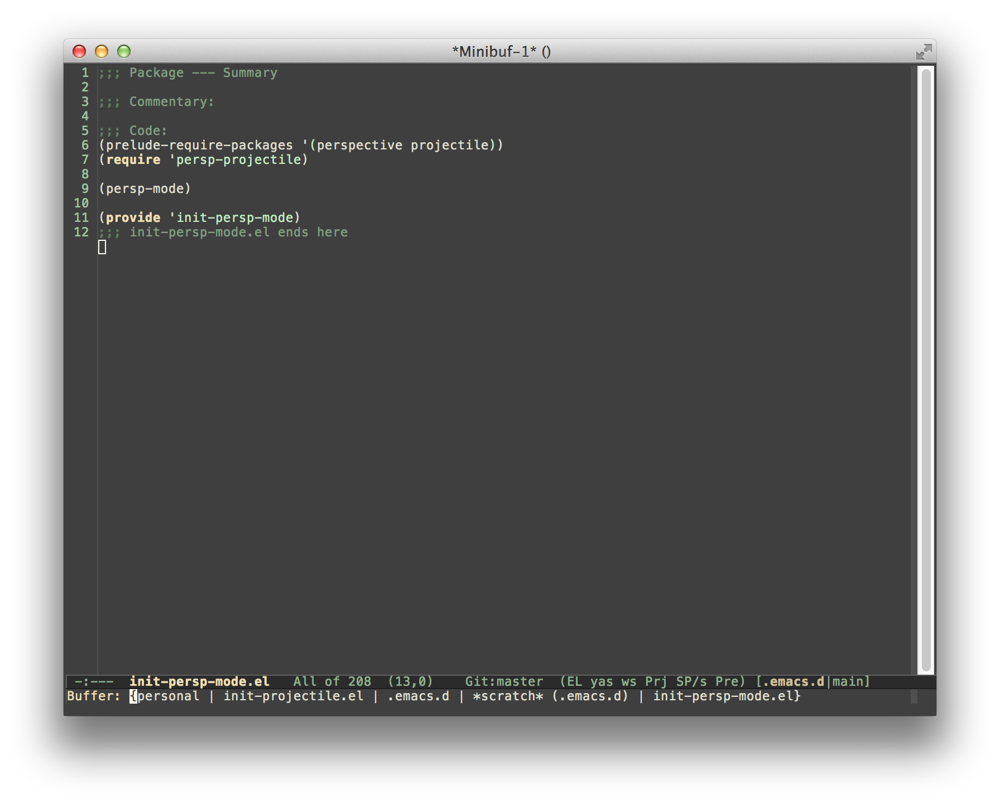
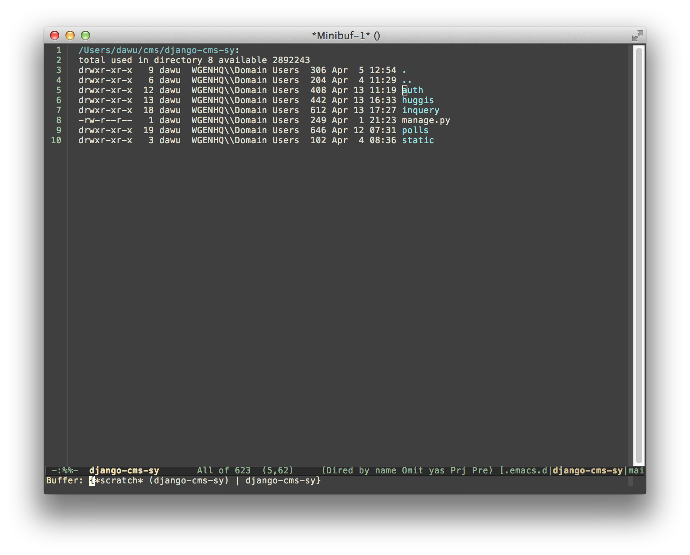

[![License GPL 3][badge-license]](http://www.gnu.org/licenses/gpl-3.0.txt)
[](http://melpa.org/#/persp-projectile)
[](http://stable.melpa.org/#/persp-projectile)
[](https://gratipay.com/projectile/)

## persp-projectile

[Perspective](https://github.com/nex3/perspective-el) is a minor mode
that provides the ability to manage different workspaces. If you need
to open many projects at the same time, perspective can help you keep
each project related buffers and windows setting separate from other
projects, similar to multiple spaces on MacOS, which allows you to
focus on the files of the current active project.

A picture says a thousand words. See below screenshot to get a concrete idea.

Only current project related files showing in minibuffer when I call
`ido-switch-buffer`, and an indicator in mode line tells me which
project that I'm in.



When I switch to a different project, I get a clean 'perspective'.



To integrate perspective with Projectile, first of all, you need to
install perspective. You can install it by:

```
M-x package-install
```

Then type `perspective` in the minibuffer, as below:

```
Install package: perspective
```

Secondly, make sure `persp-projectile.el` is in your Emacs load path. Then require it in your init file.

```el
(persp-mode)
(require 'persp-projectile)
```

You're ready to go! Try the interactive command
`projectile-persp-switch-project`, or you may also bind it to some
handy keybinding.

```el
(define-key projectile-mode-map (kbd "s-s") 'projectile-persp-switch-project)
```
